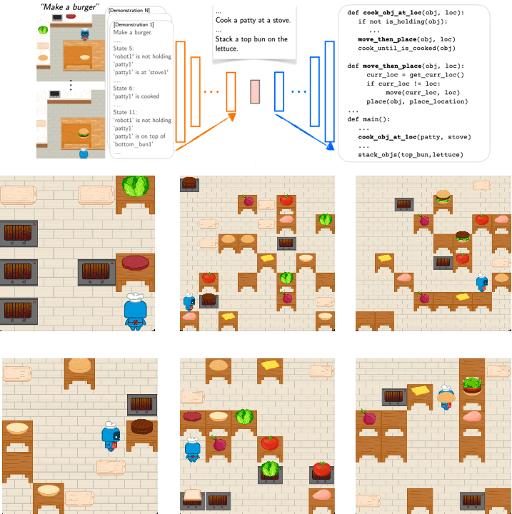
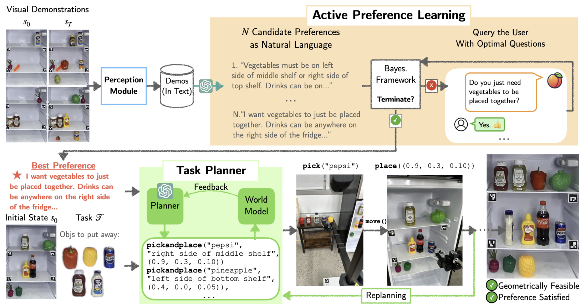
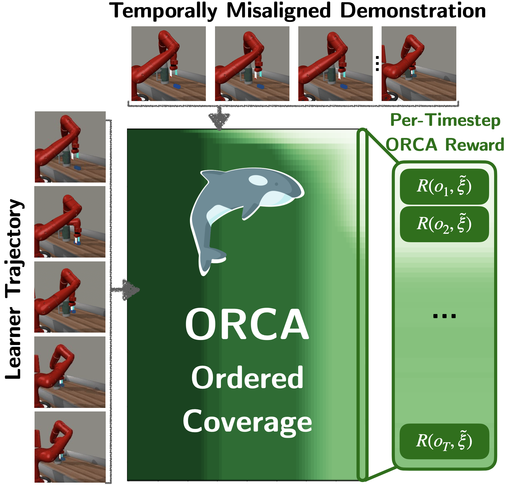

# Huaxiaoyue (Yuki) Wang
Hi! I am a final year CS PhD candidate at Cornell Univeristy. I am currently a member of the <a href='https://portal.cs.cornell.edu/'>PoRTaL lab</a>, working with <a href='https://www.sanjibanchoudhury.com/'>Prof. Sanjiban Choudhury</a>. For Summer 2025, I am a Research Intern at Adobe, working with <a href='https://research.adobe.com/person/stefano-petrangeli/'>Stefano Petrangeli</a> on AI assistants for content creation.

I work on <em>interactive AI agents that learn and act given different levels of information (e.g., goal specification, vague language feedback, few-shot video demonstrations)</em>.

My research focuses on LLM agents, imitation learning (IRL), and foundation models for robotics.

## Publications

|  |  |  |  |  |
| :---: | :---: | :---: | :---: | --- |
|   | [💻 Code](https://github.com/portal-cornell/demo2code) | [🌐 Website](https://portal-cornell.github.io/demo2code/) | [📄 Paper](https://proceedings.neurips.cc/paper_files/paper/2023/hash/30699996ff411d48903c9752b782a5c1-Abstract-Conference.html) | Demo2Code: From Summarizing Demonstrations to Synthesizing Code via Extended Chain-of-Thought (NeurIPS 2023)   **Huaxiaoyue Wang**, Gonzalo Gonzalez-Pumariega, Yash Sharma, Sanjiban Choudhury |
|   | [💻 Code](https://github.com/portal-cornell/apricot) | [🌐 Website](https://portal-cornell.github.io/apricot/) | [📄 Paper](https://openreview.net/forum?id=nQslM6f7dW) | APRICOT: Active Preference Learning and Constraint-Aware Task Planning with LLMs (CoRL 2024)   **Huaxiaoyue Wang**, Nathaniel Chin, Gonzalo Gonzalez-Pumariega, Xiangwan Sun, Neha Sunkara, Maximus Adrian Pace, Jeannette Bohg, Sanjiban Choudhury |
|   | [💻 Code](https://github.com/portal-cornell/MOSAIC) | [🌐 Website](https://portal-cornell.github.io/MOSAIC/) | [📄 Paper](https://openreview.net/forum?id=dUo6j3YURS) | MOSAIC: Modular Foundation Models for Assistive and Interactive Cooking (CoRL 2024)   **Huaxiaoyue Wang***, Kushal Kedia*, Juntao Ren*, Rahma Abdullah, Atiksh Bhardwaj, Angela Chao, Kelly Y Chen, Nathaniel Chin, Prithwish Dan, Xinyi Fan, Gonzalo Gonzalez-Pumariega, Aditya Kompella, Maximus Adrian Pace, Yash Sharma, Xiangwan Sun, Neha Sunkara, Sanjiban Choudhury |
|   | [💻 Code](https://github.com/portal-cornell/orca) | [🌐 Website](https://portal-cornell.github.io/orca/) | [📄 Paper](https://openreview.net/forum?id=YV05KZt7v2) | Imitation Learning from a Single Temporally Misaligned Video (ICML 2025)   William Huey*, **Huaxiaoyue Wang***, Anne Wu, Yoav Artzi, Sanjiban Choudhury |